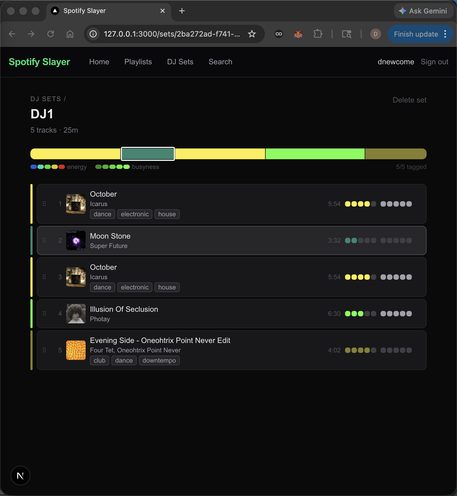

# Spotify Slayer — first build complete

_2026-03-29_

## What happened

Built this in a single session from scratch. Spotify is great for discovery but the prep workflow is a disaster — tracks get buried in Liked Songs, there's no way to tag energy or feel, no set structure, and no arc. So I built a second interface that does all of that. The tricky parts: Spotify deprecated both `localhost` redirect URIs and the `/tracks` playlist endpoint mid-session (February 2026 breaking changes), MusicBrainz returns 404 not an empty array for unknown ISRCs, and getting the arc bar selection highlight to render outside an `overflow-hidden` container required an absolutely-positioned overlay sibling. Genre tags pull from MusicBrainz via ISRC in the background — artist-level tags are far better populated than recording-level for electronic music. The result is a working set builder with energy/busyness tagging, a live color arc, and auto genre enrichment, all stored locally.

## Files touched

  - README.md

## Tweet draft

Built a DJ set builder on top of Spotify because the native UI is terrible for prep. Auto genre tags from MusicBrainz, per-track energy/busyness dot selectors, and a color arc that shows the shape of your whole set at a glance. No database, stores locally. One session. [link]

---

_commit: 20de0c0 · screenshot: captured (window)_
