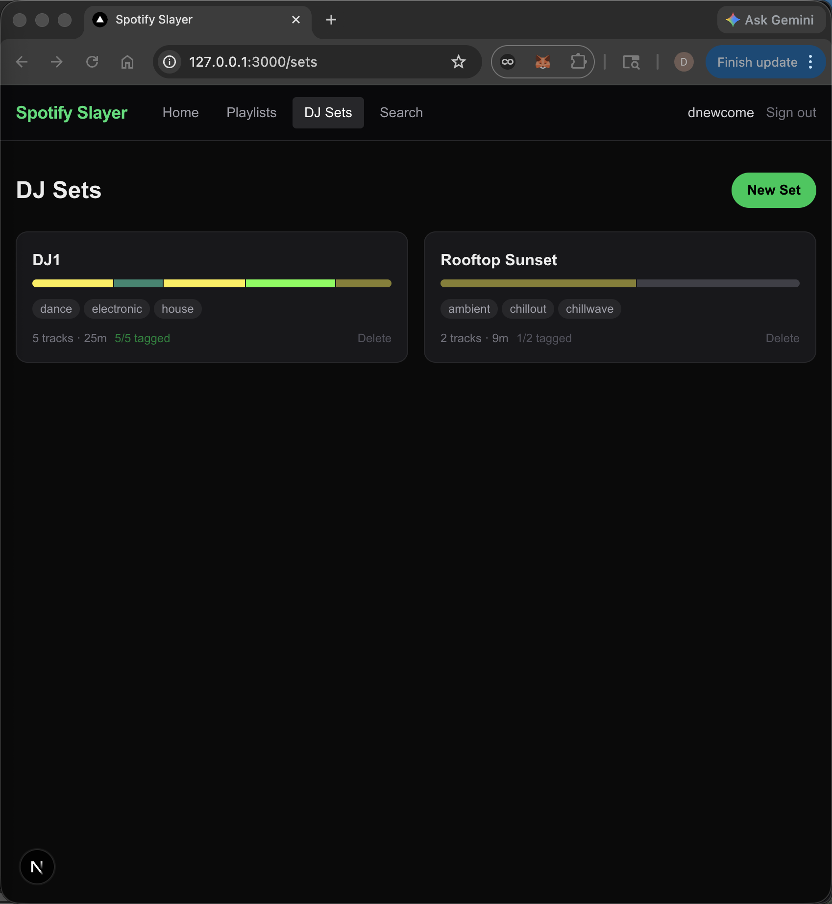

# Sets list upgrade + search fixed

_2026-03-29_

## What happened

The sets list page was a plain text grid — just names and track counts. Upgraded it so each card now shows a mini energy arc bar (same color encoding as the detail view, blocks proportional to duration), top genres pulled from the MusicBrainz data already in the library, and a tagged count. The whole card is now clickable instead of just the title. Also tracked down a search regression: Spotify's 2026 API is now rejecting the `limit` parameter on the search endpoint as invalid — stripped it out and added `market=from_token` instead, which fixed it. Another undocumented breaking change to add to the list.

## Files touched

  - src/app/sets/page.tsx
  - src/app/api/search/route.ts
  - src/lib/spotify.ts
  - README.md

## Tweet draft

The sets list was just a list of names. Now each card shows the energy arc, top genres, and tagged count at a glance — you can see the shape of every set before you open it. Also hit another undocumented 2026 Spotify API break: the search `limit` param is now rejected as invalid. [link]

---

_commit: 9e2471e · screenshot: captured (window)_
