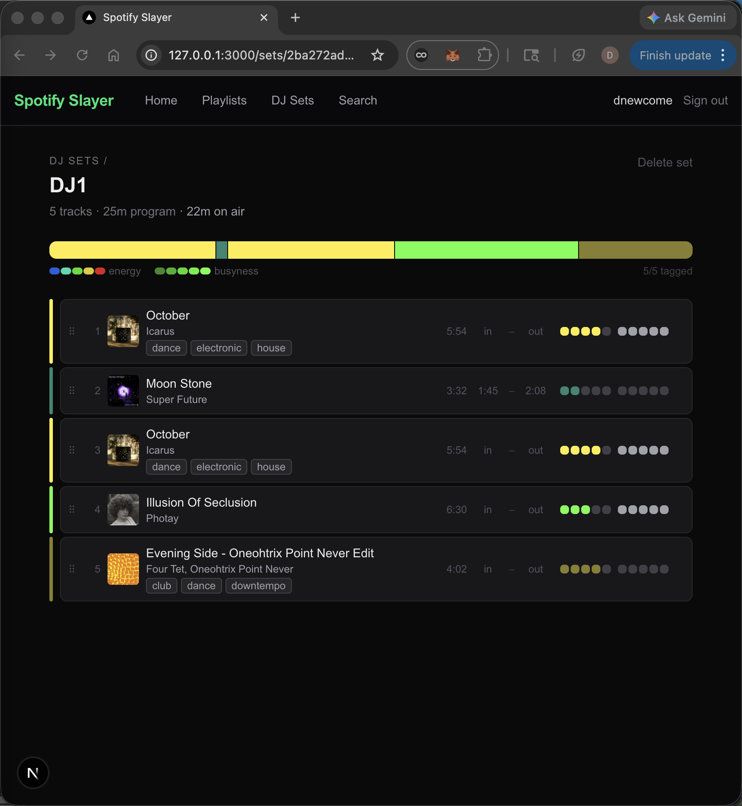

# In/out points and broadcast timing

_2026-03-29_

## What happened

Added in/out point markers to each track in the set builder. They're rough — no audio playback, just a `mm:ss` input you click to set. The idea is to mark which part of a track is actually being used in the mix: a 6-minute track where you're only using the first 3 minutes should only contribute 3 minutes to the set arc, not 6. The arc bar now uses active duration (out minus in) for block widths, so the shape reflects what will actually play. The header shows two durations: "program" (sum of full track lengths, broadcast term for scheduled content) and "on air" (sum of active regions, only shown when in/out points exist). Same on the sets list cards. Dialing in the terminology felt important — this is a tool for people who think in broadcast concepts.

## Files touched

  - src/lib/types.ts
  - src/lib/sets.ts
  - src/app/sets/[id]/page.tsx
  - src/app/sets/page.tsx

## Tweet draft

Added in/out markers to the DJ set builder — click to set which part of each track is actually in the mix. The arc bar updates to reflect real active durations, and the header now shows "program" vs "on air" time. Rough but useful: you can see the real shape of a set before you've touched a fader. [link]

---

_commit: 282a95b · screenshot: captured (window)_
