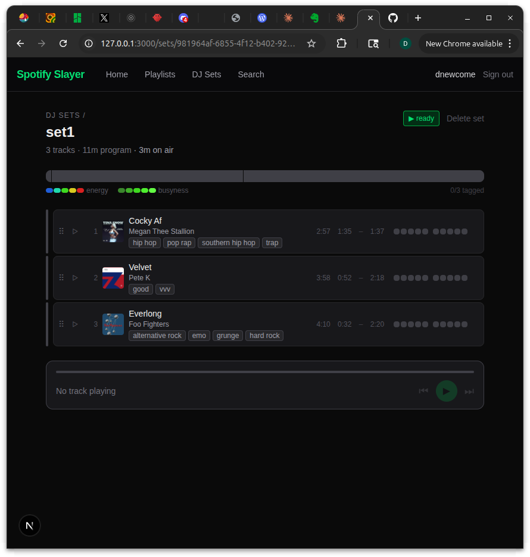

# Add local file storage architecture plan (file server, tag matching, cloud path)

_2026-04-02_

## What happened

I mapped out how local audio files — FLACs sitting in a folder — get connected to the Spotify track library. The interesting problem isn't serving the file (that's one API route with a path-traversal check), it's the matching: a downloaded file has no Spotify ID, so you chain through ISRC, then MBID, then fuzzy title+artist. The part I'm happiest with is the `localPath` field design: local files get a relative path, future cloud files get a URI-scheme prefix, and the rest of the app never knows the difference — switching from `fs.createReadStream` to `s3.getObject` is a one-line swap. Cloud storage got deferred until the local workflow is actually proven end-to-end.

## Files touched

  - PLAN.md

## Screenshot

## Tweet draft

Building a DJ set tool that plays from Spotify but will eventually play local FLACs too. Spent today on the matching problem: how does a file on disk find its Spotify track? Chain ISRC → MBID → fuzzy title. The data model stays the same whether it's local or S3. [link]

---

_commit: 76d9694 · screenshot: captured (manual)_
