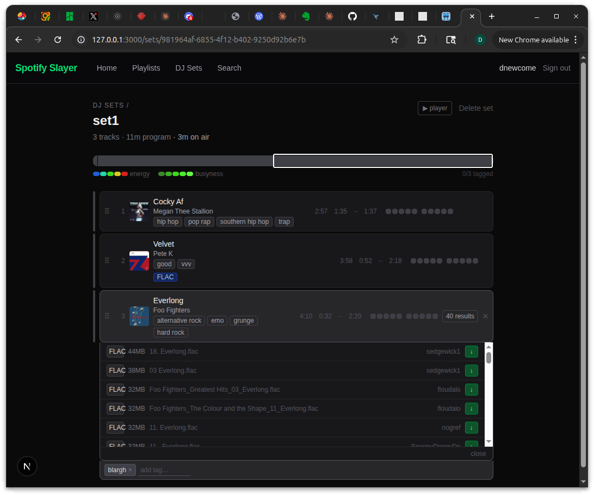

# slskd download working — FLAC search results drawer live

_2026-04-02_

## What happened

Wired up the full slskd acquisition flow end-to-end: hit "find" on a track row, the app searches Soulseek via the slskd REST API, polls until complete, then drops a results drawer inline showing every FLAC and MP3 ranked by quality. The tricky part was discovering the actual slskd API shape through live testing — the download endpoint wants an array body and returns a nested `{ enqueued, failed }` response, not what the docs imply. Clicking the download arrow kicks off the transfer and polls for progress. The "FLAC" badge on Velvet is real — that track is already on disk, pulled from Soulseek, living next to the Spotify metadata.

## Files touched

  - src/lib/types.ts
  - src/app/api/slskd/search/route.ts
  - src/app/api/slskd/search/[searchId]/route.ts
  - src/app/api/slskd/download/route.ts
  - src/app/api/slskd/transfer/[transferId]/route.ts
  - src/app/sets/[id]/page.tsx
  - .env

## Tweet draft

Built the Soulseek download flow into my DJ prep tool. Browse Spotify, hit "find" on a track, and a drawer pops up with every FLAC ranked by size. One click to download. Already got a FLAC sitting next to the Spotify metadata. The gap between "I want this" and "I have this" is closing. [link]

---

_commit: f0e82de · screenshot: captured (manual)_
